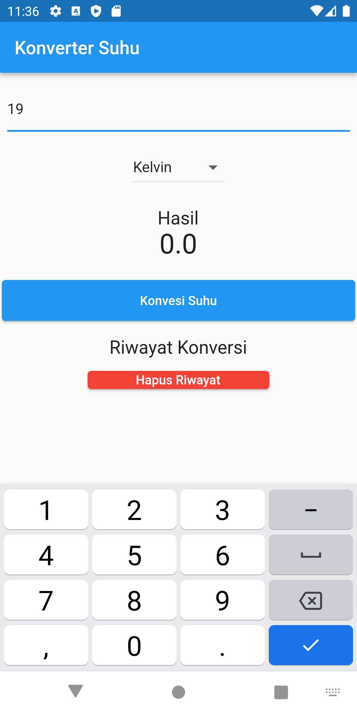
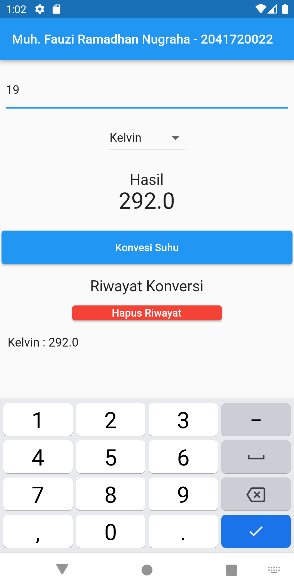
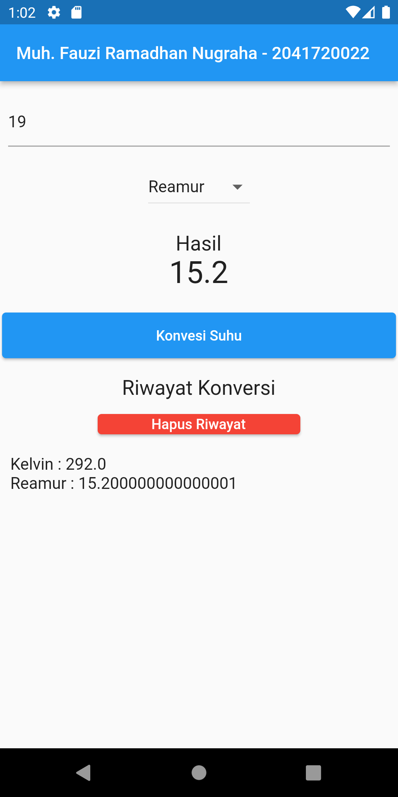
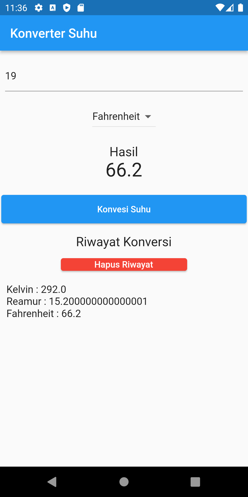
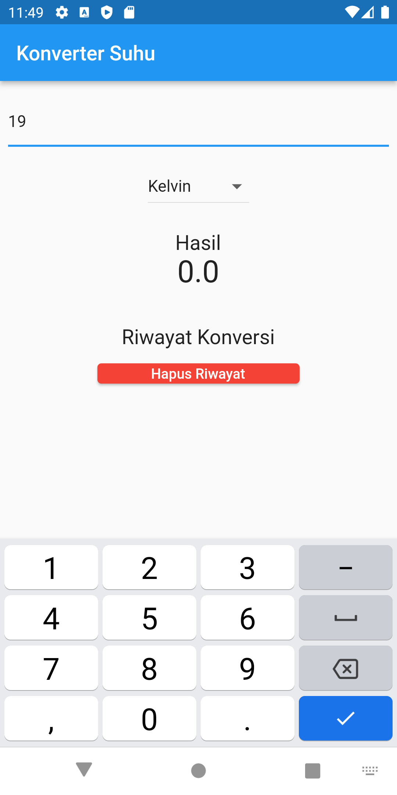
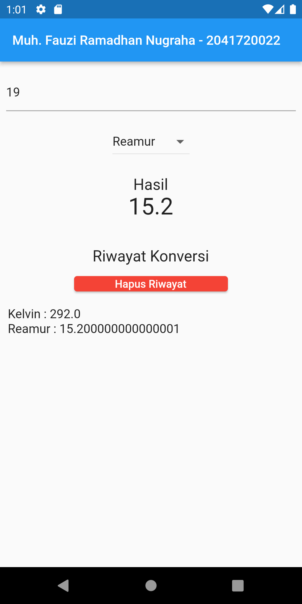
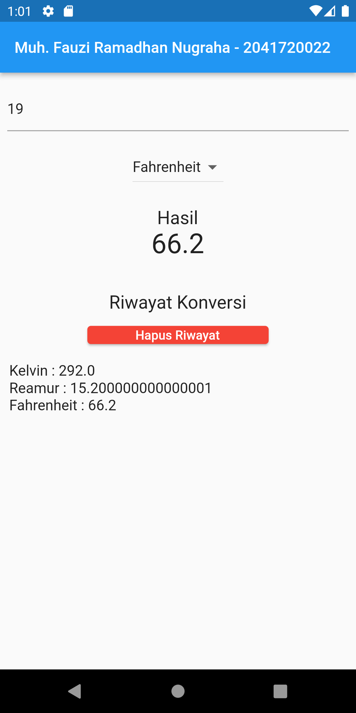

# konversi_suhu_flutter

<li>Muh. Fauzi Ramadhan Nugraha</li>
<li>TI - 3B</li>
<li>2041720022</li>

 

Aplikasi Flutter dengan Statefull Widget - Konversi Suhu Celcius ke Kelvin dan Reamur.

Berikut beberapa hasil praktikum yang berhasil saya kerjakan :

## Jobsheet 4 - Praktikum

| Home Application | Input Suhu | Click Konversi Suhu |
| ------------------ | --------------------------- | ------------------ |
|   |  |  |

| Menu Dropdown | Reamur And Click Konversi Suhu | Fahrenheit And Click Konversi Suhu |
| ------------------ | --------------------------- | ------------------ |
|   |  |  |

| Click Hapus Riwayat |
| ------------------ |
|   |

## Jobsheet 4 - Tugas (Melakukan Konversi Tanpa Klik)

| Home Application | Input Suhu |
| ------------------ | --------------------------- |
|   |  |

| Click Kelvin | Click Reamur | Click Fahrenheit |
| ------------------ | --------------------------- | ------------------ |
|   |  |  |

